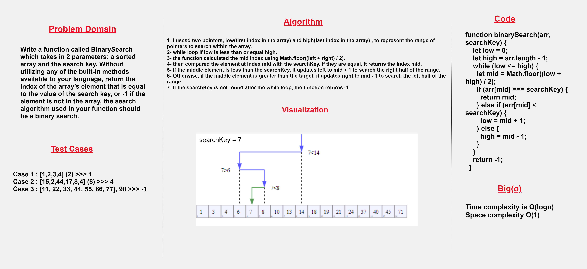
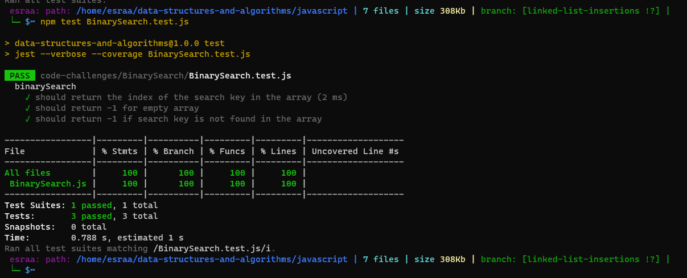

# Array Binary Search

## Summary 
The Array Binary Search algorithm is a search algorithm used to find the index of a target element in a sorted array. 

## Description
The Array Binary Search algorithm is used to locate a specific element within a sorted array. It starts by defining a range that spans the entire array, with the left and right index initially set to the first and last indices of the array, respectively.


## Whiteboard Process



## Solution
``` java script
function binarySearch(arr, searchKey) {
    let low = 0;
    let high = arr.length - 1;
    while (low <= high) {
      let mid = Math.floor((low + high) / 2);
      if (arr[mid] === searchKey) {
        return mid;
      } else if (arr[mid] < searchKey) {
        low = mid + 1;
      } else {
        high = mid - 1;
      }
    }
    return -1;
  }
```
## Test 

