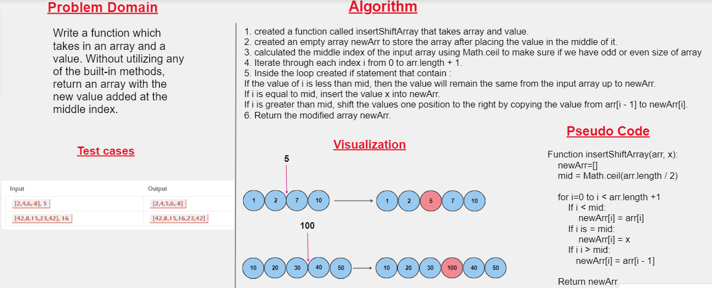

# Code Challenge: Class 01

## Insert Shift Array

## Summary : 
The challenge is to insert a value in the middle of the array, whether the size of the array is odd or even.

## Description :
The insertShiftArray function to insert a value at the middle index of an input array. It creates a new array and uses a loop to iterate through the indices of the input array,the function handles both odd and even-sized input arrays correctly.

## Whiteboard Process


## Approach & Efficiency : 
Time Complexity: O(n), where n is the length of the input array arr. This is because the function iterates through each index of the array once.
Space Complexity:O(n) as well since the function creates a new array newArr with the same length as the input array.

## Solution
```javascript

function insertShiftArray(arr, X){
    let newArr = [];
    let mid = Math.ceil(arr.length / 2);
    for(let i = 0; i < arr.length + 1; i++) {
      if(i < mid) {
        newArr[i] = arr[i];
      }
      if(i === mid) {
        newArr[i] = X;
      }
      else if(i > mid) {
        newArr[i] = arr[i - 1];
      }
    }
    return newArr;
  }
```
    
## Unit tests written and passing
```javascript
describe('Testing insertShiftArray function', () => {
    test('It should return a new array with the value inserted at the middle index', () => {
        expect(insertShiftArray([1, 2, 3, 4, 5, 6], 100)).toStrictEqual([1, 2, 3, 100, 4, 5, 6]);
        expect(insertShiftArray([2, 3, 5, 7, 8], 100)).toStrictEqual([2, 3, 5, 100, 7, 8]);
      });
});
```


