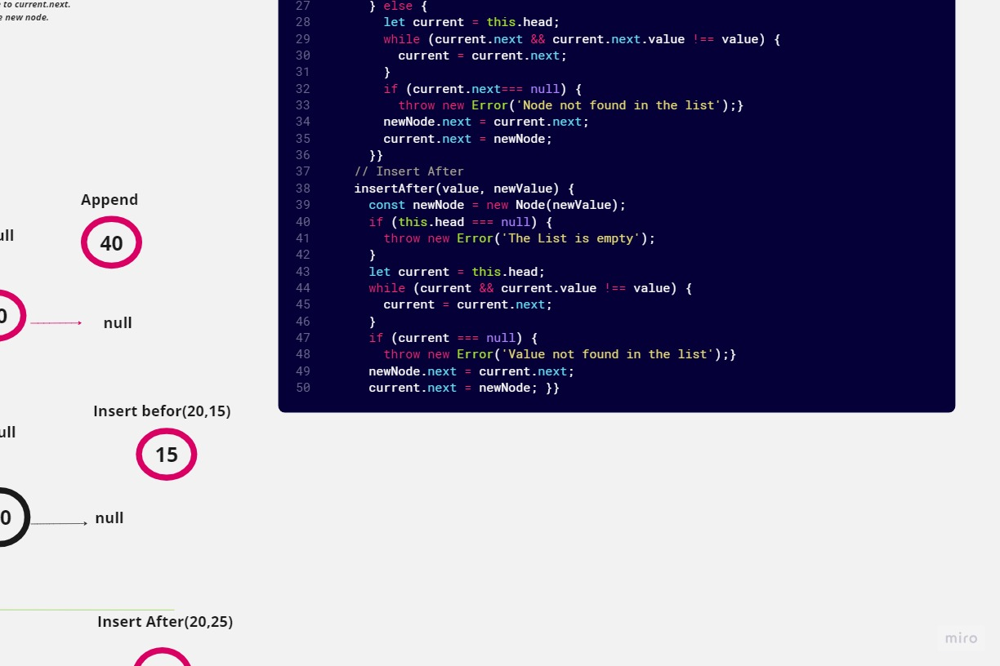
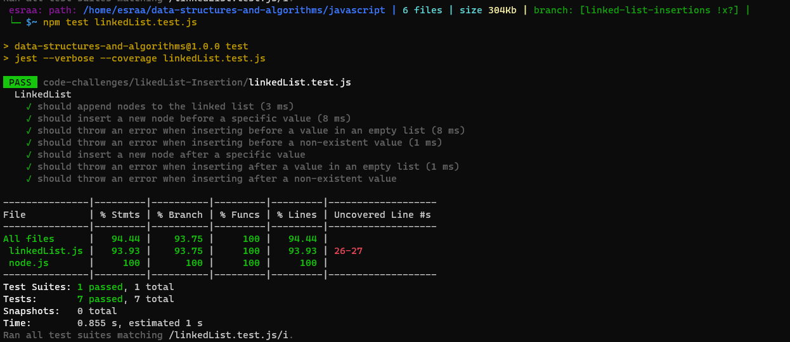

# linked list insertion
## Summary:
In this code challenge provides methods to append a new node at the end of the Linked list, insert a new node before a specific value, and insert a new node after a specific value.
## Whiteboard Process

## Solution:
- node.js
```
'use strict' ;
class Node {
    constructor(value) {
      this.value = value;
      this.next = null;
    }
  }
  module.exports = Node;
```
- linkedList.js
``` javascript
"use strict";
const Node = require("./node");
class LinkedList {
  constructor() {
    this.head = null;
  }
  // Append Method
  append(value) {
    const newNode = new Node(value);
    if (this.head === null) {
      this.head = newNode;
    } else {
      let current = this.head;
      while (current.next) {
        current = current.next;
      }
      current.next = newNode;
    }
  }
  
  // Insert Befor
  insertBefore(value, newValue){
    const newNode = new Node(newValue);
    if (this.head === null) {
      throw new Error('The List is empty');
    } else if (this.head.value === value) {
      newNode.next = this.head;
      this.head = newNode;
    } else {
      let current = this.head;
      while (current.next && current.next.value !== value) {
        current = current.next;
      }
      if (current.next=== null) {
        throw new Error('Node not found in the list');
      }
      newNode.next = current.next;
      current.next = newNode;
    }
  }

  // Insert After
  insertAfter(value, newValue) {
    const newNode = new Node(newValue);
    if (this.head === null) {
      throw new Error('The List is empty');
    }
    let current = this.head;
    while (current && current.value !== value) {
      current = current.next;
    }
    if (current === null) {
      throw new Error('Value not found in the list');
    }
    newNode.next = current.next;
    current.next = newNode;
  }
  
}
module.exports = LinkedList;
```

## Testing: 
