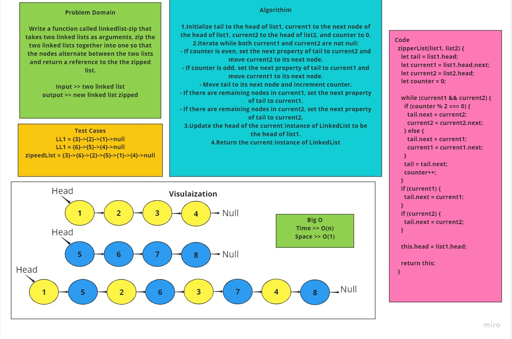
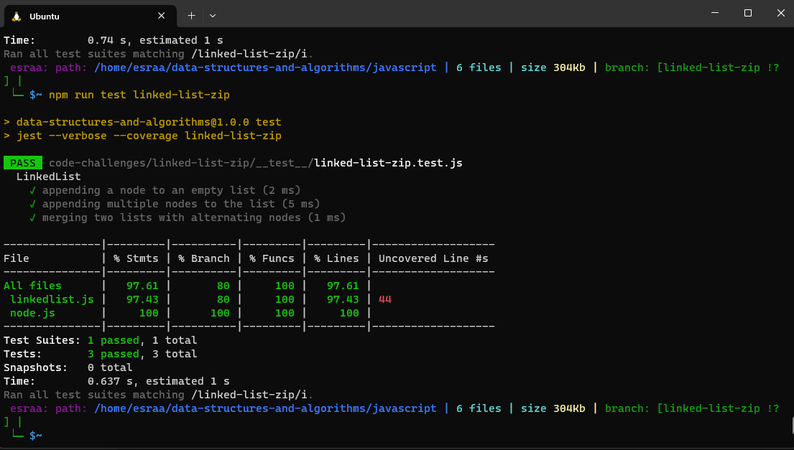

# Linked list Zip

## Summary 
The zipperList method merges two linked lists, list1 and list2, by alternating their nodes. It iterates through both lists, starting from the head, and connects the nodes in an alternating fashion. It updates the head of the current instance of LinkedList to be the head of list1. Finally, it returns the current instance of LinkedList with the merged nodes.
## Whiteboard Process

## Solution
[LinkedList.js](/code-challenges/linked-list-zip/lib/linkedlist.js)

[node.js](/code-challenges/linked-list-zip/lib/node.js)

[linkedList-kth.test.js](/code-challenges/)
## Testing

