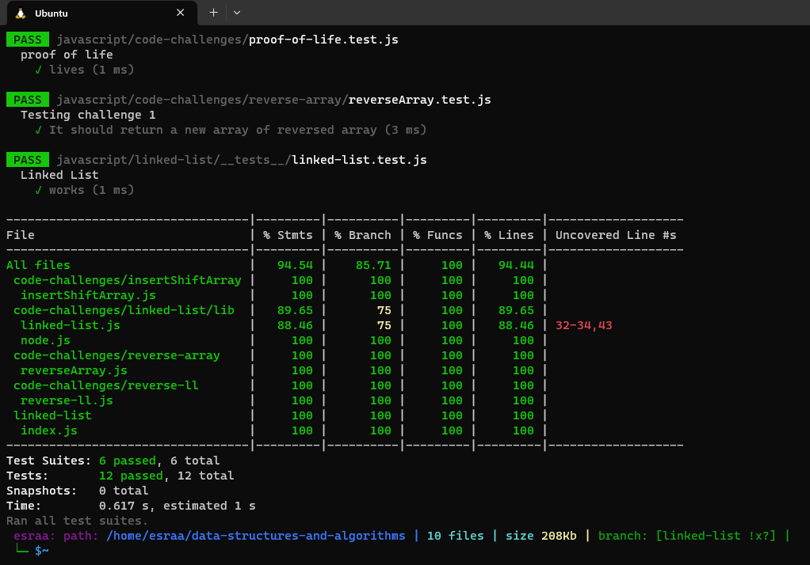

# Singly Linked Lists
## Summary
In this challenge we need to create Liked list with three methods(insert, include and toString):
insert : Adds a new node with that value to the head of the list with an O(1) Time performance.
include :Indicates whether that value exists as a Node’s value somewhere within the list.
toString :Returns: a string representing all the values in the Linked List.
## Approach & Efficiency
- The time complexity of inserting a new node at the head of the list is O(1).
- The space complexity of the linked list is O(n).
- (insert(value), includes(value), toString())The time complexity of these operation is O(n)
## Whiteboard Process

## Unit tests written and passing
[Tests](./__test_/linked-list.test.js)
## Solution
[soukution](./lib/linked-list.js)
## Screenshot of the tests
