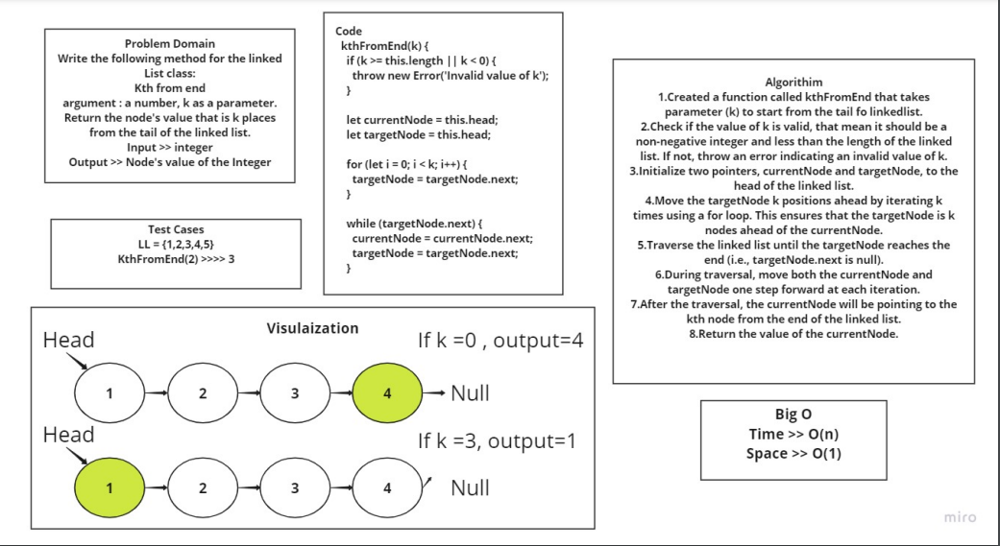

# linked list kth
## summary 
In this challenge used the kthFromEnd method that takes a integer k as argument and returns the value of the kth node from the end of the linked list.

## solution 
[LinkedList.js](/javascript/code-challenges/linkedList-kth/lib/linkedList.js)

[node.js](/javascript/code-challenges/linkedList-kth/lib/node.js)

[linkedList-kth.test.js](/javascript/code-challenges/linkedList-kth/__test__/linkedList-kth.test.js)
## WhiteBoard process
 WhiteBoard :
 

## Testing
 