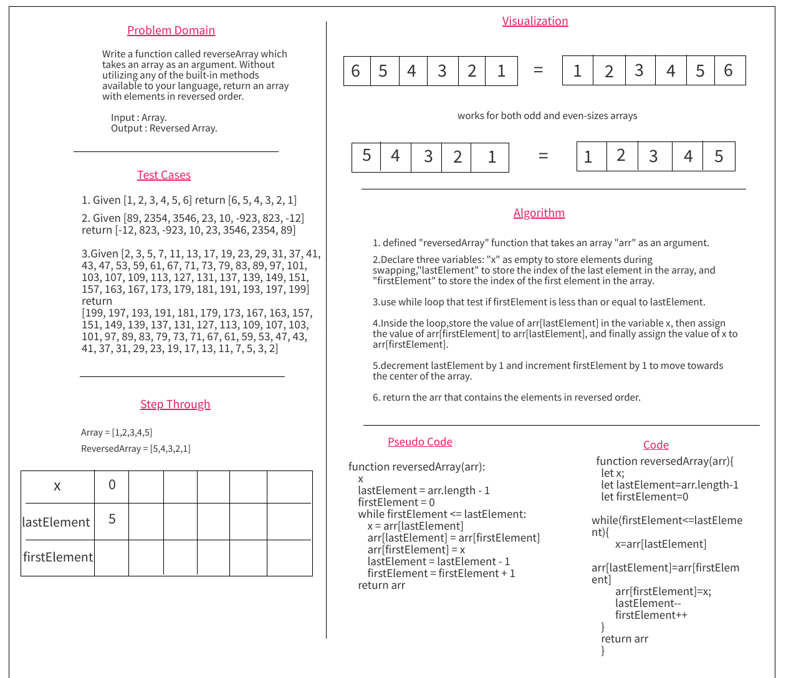

# Code Challenge: Class 01

## Array Reverse

## Summary : 
The challenge is to invert the array without using any built-in methods.
By taking a array and returning a new array, its inverse is the result.

## Description :
The reversedArray function takes an array as input and returns a new array with the elements in reversed order. It uses a two-pointer approach to swap elements from both ends of the array until the pointers meet at the middle. The function then returns the modified array.

## Whiteboard Process

## Approach & Efficiency : 
The approach used in the provided code to reverse an array is the "Two-Pointer Swap" approach. This approach involves using two pointers, one starting from the beginning of the array (firstElement), and the other starting from the end of the array (lastElement). These pointers traverse the array towards the center, swapping elements along the way until they meet.

## Solution

  function reversedArray(arr){
    let x;
    let lastElement=arr.length-1
    let firstElement=0
    while(firstElement<=lastElement){
          x=arr[lastElement]
          arr[lastElement]=arr[firstElement]
          arr[firstElement]=x;
          lastElement--
          firstElement++
    }
    return arr
    }
    
## Unit tests written and passing

const reversedArray = require('../reverse-array/reverseArray');
describe('Testing challenge 1', () => {
    test('It should return a new array of reversed array', () => {
        expect(reversedArray([1, 2, 3, 4, 5, 6])).toStrictEqual([6, 5, 4, 3, 2, 1]);
        expect(reversedArray([89, 2354, 3546, 23, 10, -923, 823, -12])).toStrictEqual([-12, 823, -923, 10, 23, 3546, 2354, 89]);
        expect(reversedArray([2, 3, 5, 7, 11, 13, 17, 19, 23, 29, 31, 37, 41, 43, 47, 53, 59, 61, 67, 71, 73, 79, 83, 89, 97, 101, 103, 107, 109, 113, 127, 131, 137, 139, 149, 151, 157, 163, 167, 173, 179, 181, 191, 193, 197, 199])).toStrictEqual([199, 197, 193, 191, 181, 179, 173, 167, 163, 157, 151, 149, 139, 137, 131, 127, 113, 109, 107, 103, 101, 97, 89, 83, 79, 73, 71, 67, 61, 59, 53, 47, 43, 41, 37, 31, 29, 23, 19, 17, 13, 11, 7, 5, 3, 2]);
    });
    });

